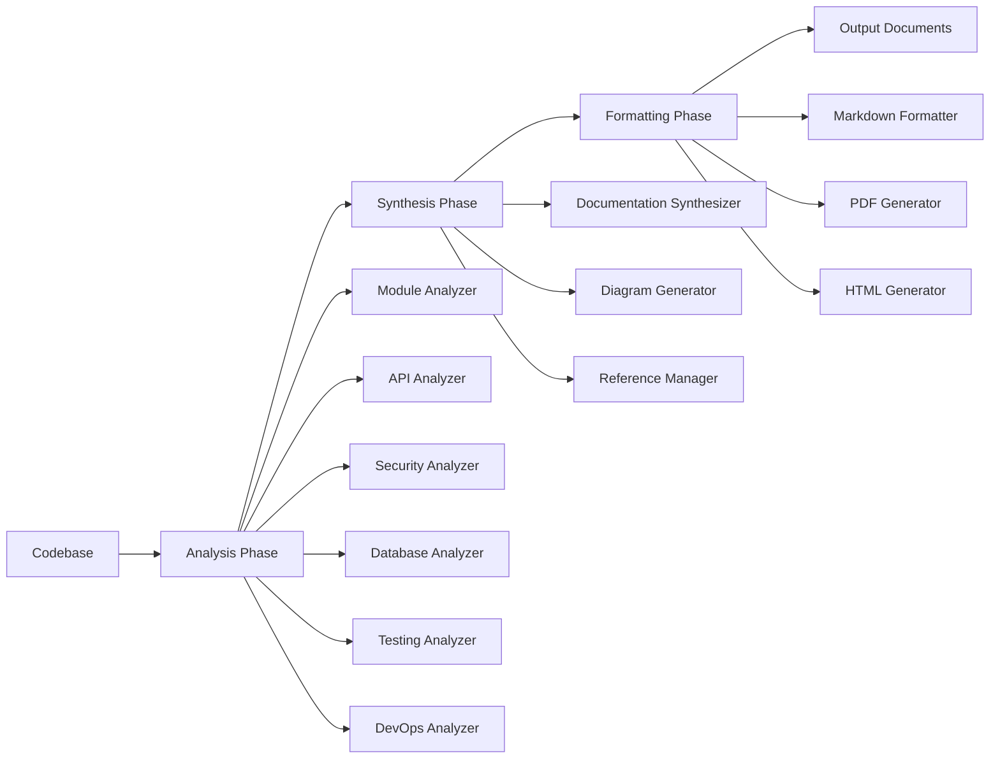

# Design Document: Comprehensive Academic Technical Documentation System

## Overview

The Comprehensive Academic Technical Documentation System is an automated documentation generator designed to analyze the Hybrid LMS Backend codebase and produce a complete, academic-quality technical report suitable for BPR601 graduation project evaluation. The system extracts architectural patterns, security implementations, API contracts, database schemas, testing strategies, and DevOps configurations from the codebase, then synthesizes this information into a structured markdown document with embedded diagrams, code examples, and academic references.

### Problem Statement

The Hybrid LMS Backend is a production-ready system with 11 major modules, 30+ Mongoose models, comprehensive security implementations, and extensive DevOps automation. Manually documenting such a complex system is time-consuming, error-prone, and quickly becomes outdated as the codebase evolves. Academic projects require documentation that demonstrates mastery of software engineering principles, adherence to industry standards, and comprehensive system understanding. This documentation must be accurate, complete, and presented with academic rigor.

### Solution Approach

The Documentation Generator implements a multi-phase pipeline architecture where specialized analyzer components extract information from different aspects of the codebase (code structure, configuration files, schemas, tests, security implementations), then formatter components synthesize this information into structured documentation sections with appropriate academic context, diagrams, and references. The system uses static code analysis, AST parsing, configuration parsing, and template-based formatting to automate the documentation generation process while maintaining human readability and academic standards.

### Key Design Principles

1. **Separation of Concerns**: Analysis logic is separated from formatting logic, enabling independent evolution of extraction algorithms and presentation formats
2. **Extensibility**: Plugin-based architecture allows adding new analyzers and formatters without modifying core pipeline
3. **Accuracy**: All information extracted directly from source code and configurations, minimizing manual entry errors
4. **Traceability**: Generated documentation includes cross-references to source files and line numbers
5. **Academic Rigor**: Output includes proper citations, formal language, and comprehensive analysis suitable for university evaluation

## Architecture

### High-Level Architecture

The system follows a pipeline architecture with three primary phases:



**Phase 1: Analysis Phase**
- Multiple specialized analyzers scan the codebase
- Each analyzer focuses on a specific concern (API structure, security, database, etc.)
- Analyzers produce structured intermediate representations (JSON/AST)
- Parallel execution for independent analyzers

**Phase 2: Synthesis Phase**
- Documentation synthesizer combines analyzer outputs
- Cross-references and relationships are established
- Diagram generator creates visual representations
- Reference manager collects and formats citations

**Phase 3: Formatting Phase**
- Multiple formatters generate different output formats
- Markdown formatter produces primary documentation
- PDF and HTML generators create alternative formats
- Template engine applies academic styling

### Layered Architecture

The system implements a layered architecture for maintainability and testability:

```
┌─────────────────────────────────────────────┐
│         Presentation Layer                  │
│  (CLI Interface, Report Templates)          │
└─────────────────────────────────────────────┘
                    ↓
┌─────────────────────────────────────────────┐
│         Application Layer                   │
│  (Documentation Generator, Pipeline)        │
└─────────────────────────────────────────────┘
                    ↓
┌─────────────────────────────────────────────┐
│         Domain Layer                        │
│  (Analyzers, Synthesizers, Formatters)     │
└─────────────────────────────────────────────┘
                    ↓
┌─────────────────────────────────────────────┐
│         Infrastructure Layer                │
│  (File System, AST Parser, Config Parser)  │
└─────────────────────────────────────────────┘
```

**Presentation Layer**: Provides user interface for triggering documentation generation and viewing reports
**Application Layer**: Orchestrates the documentation generation pipeline, coordinates analyzers and formatters
**Domain Layer**: Contains core business logic for analysis, synthesis, and formatting
**Infrastructure Layer**: Handles low-level operations like file I/O, parsing, and external tool invocation

## Components and Interfaces

### 1. Documentation_Generator (Core Orchestrator)

**Responsibility**: Coordinates the entire documentation generation pipeline

**Interface**:
```javascript
class DocumentationGenerator {
  /**
   * Generates comprehensive documentation for the codebase
   * @param {Object} config - Configuration options
   * @param {string} config.sourceDir - Path to source code directory
   * @param {string} config.outputPath - Path for generated documentation
   * @param {string[]} config.formats - Output formats ['markdown', 'pdf', 'html']
   * @param {Object} config.academicConfig - Academic formatting preferences
   * @returns {Promise<GenerationReport>} Report with metrics and warnings
   */
  async generateDocumentation(config);
  
  /**
   * Validates codebase structure before documentation generation
   * @param {string} sourceDir - Path to source code
   * @returns {Promise<ValidationResult>} Validation result with errors
   */
  async validateCodebase(sourceDir);
  
  /**
   * Generates documentation changelog for incremental updates
   * @param {string} previousVersion - Previous documentation version
   * @param {string} currentVersion - Current codebase version
   * @returns {Promise<ChangeLog>} Changes since last generation
   */
  async generateChangelog(previousVersion, currentVersion);
}
```

**Key Responsibilities**:
- Initialize and coordinate all analyzer components
- Manage execution order and dependencies between analyzers
- Aggregate analyzer outputs into unified documentation structure
- Invoke formatters for multiple output formats
- Validate completeness and quality of generated documentation

**Design Patterns**: Facade pattern (simplifies complex subsystem), Coordinator pattern

### 2. Module_Analyzer

**Responsibility**: Analyzes module structure, responsibilities, and interactions

**Interface**:
```javascript
class ModuleAnalyzer {
  /**
   * Analyzes all modules in the codebase
   * @param {string} sourceDir - Path to source directory
   * @returns {Promise<ModuleAnalysis>} Detailed module information
   */
  async analyzeModules(sourceDir);
  
  /**
   * Extracts module dependencies and relationships
   * @param {string} modulePath - Path to module directory
   * @returns {Promise<ModuleDependencies>} Dependency graph
   */
  async extractDependencies(modulePath);
  
  /**
   * Identifies design patterns used in module
   * @param {string} modulePath - Path to module
   * @returns {Promise<DesignPattern[]>} Detected design patterns
   */
  async identifyPatterns(modulePath);
}
```

**Key Responsibilities**:
- Scan controllers, services, routes, and models directories
- Extract module responsibilities from code comments and structure
- Identify controller-service-model relationships
- Detect design patterns (Repository, Factory, Strategy)
- Generate use case descriptions from endpoint implementations

### 3. API_Documenter

**Responsibility**: Extracts and documents RESTful API endpoints

**Interface**:
```javascript
class APIDocumenter {
  /**
   * Analyzes all API routes and generates documentation
   * @param {string} routesDir - Path to routes directory
   * @returns {Promise<APIDocumentation>} Complete API documentation
   */
  async documentAPI(routesDir);
  
  /**
   * Extracts endpoint details from route definition
   * @param {string} routeFile - Path to route file
   * @returns {Promise<Endpoint[]>} Endpoint specifications
   */
  async extractEndpoints(routeFile);
  
  /**
   * Generates OpenAPI 3.0 specification
   * @param {APIDocumentation} apiDocs - Extracted API documentation
   * @returns {Object} OpenAPI specification object
   */
  generateOpenAPISpec(apiDocs);
}
```

**Key Responsibilities**:
- Parse Express route definitions from routes directory
- Extract HTTP methods, paths, middleware chains
- Document request validation using Zod schemas
- Extract response formats from controller implementations
- Generate example requests and responses
- Produce OpenAPI 3.0 specification

### 4. Security_Analyzer

**Responsibility**: Analyzes security implementations and compliance

**Interface**:
```javascript
class SecurityAnalyzer {
  /**
   * Analyzes security implementations across the codebase
   * @param {string} sourceDir - Path to source directory
   * @returns {Promise<SecurityAnalysis>} Security documentation
   */
  async analyzeSecurityImplementations(sourceDir);
  
  /**
   * Checks OWASP Top 10 compliance
   * @param {string} sourceDir - Path to source directory
   * @returns {Promise<OWASPCompliance>} Compliance report
   */
  async checkOWASPCompliance(sourceDir);
  
  /**
   * Analyzes authentication and authorization flows
   * @param {string} authDir - Path to auth module
   * @returns {Promise<AuthFlows>} Authentication flow documentation
   */
  async analyzeAuthFlows(authDir);
  
  /**
   * Extracts encryption implementations
   * @param {string} sourceDir - Path to source directory
   * @returns {Promise<EncryptionDetails>} Encryption documentation
   */
  async analyzeEncryption(sourceDir);
}
```

**Key Responsibilities**:
- Identify authentication mechanisms (JWT, MFA, OAuth)
- Document password hashing (Argon2id parameters)
- Extract encryption implementations (AES-256-GCM, Ed25519)
- Analyze CSRF protection, rate limiting, input validation
- Check OWASP Top 10 countermeasures
- Document security headers (Helmet.js configuration)
- Extract audit logging implementations

### 5. Database_Documenter

**Responsibility**: Documents database schemas and relationships

**Interface**:
```javascript
class DatabaseDocumenter {
  /**
   * Analyzes all Mongoose schemas
   * @param {string} modelsDir - Path to models directory
   * @returns {Promise<DatabaseDocumentation>} Database documentation
   */
  async documentDatabase(modelsDir);
  
  /**
   * Extracts schema details from Mongoose model
   * @param {string} modelFile - Path to model file
   * @returns {Promise<SchemaDetails>} Schema specification
   */
  async extractSchema(modelFile);
  
  /**
   * Analyzes relationships between models
   * @param {SchemaDetails[]} schemas - All schemas
   * @returns {Promise<Relationships>} Relationship documentation
   */
  async analyzeRelationships(schemas);
  
  /**
   * Generates Entity-Relationship diagram
   * @param {DatabaseDocumentation} dbDocs - Database documentation
   * @returns {Promise<string>} Mermaid ER diagram definition
   */
  async generateERDiagram(dbDocs);
}
```

**Key Responsibilities**:
- Parse Mongoose schema definitions from models directory
- Extract field types, constraints, validation rules
- Document indexes and their justifications
- Identify relationships (ref fields, embedded documents)
- Analyze normalization level
- Generate Entity-Relationship diagrams
- Document schema versioning strategies

### 6. Architecture_Diagrammer

**Responsibility**: Generates architectural diagrams

**Interface**:
```javascript
class ArchitectureDiagrammer {
  /**
   * Generates system architecture diagram
   * @param {ModuleAnalysis} modules - Module analysis results
   * @returns {Promise<string>} Mermaid diagram definition
   */
  async generateArchitectureDiagram(modules);
  
  /**
   * Generates sequence diagram for workflow
   * @param {string} workflowName - Workflow identifier
   * @param {string} sourceDir - Path to source directory
   * @returns {Promise<string>} Mermaid sequence diagram
   */
  async generateSequenceDiagram(workflowName, sourceDir);
  
  /**
   * Generates component diagram showing dependencies
   * @param {ModuleDependencies} dependencies - Dependency graph
   * @returns {Promise<string>} Mermaid component diagram
   */
  async generateComponentDiagram(dependencies);
  
  /**
   * Generates data flow diagram
   * @param {string} feature - Feature to document
   * @param {ModuleAnalysis} modules - Module analysis
   * @returns {Promise<string>} Mermaid data flow diagram
   */
  async generateDataFlowDiagram(feature, modules);
}
```

**Key Responsibilities**:
- Generate layered architecture diagrams (MVCS structure)
- Create sequence diagrams for authentication flows
- Generate component interaction diagrams
- Create data flow diagrams
- Produce deployment topology diagrams
- Use Mermaid.js for diagram generation
- Export diagrams to PNG/SVG for PDF inclusion

### 7. Testing_Analyzer

**Responsibility**: Documents testing strategies and coverage

**Interface**:
```javascript
class TestingAnalyzer {
  /**
   * Analyzes testing strategy and coverage
   * @param {string} testsDir - Path to tests directory
   * @param {string} coverageDir - Path to coverage reports
   * @returns {Promise<TestingAnalysis>} Testing documentation
   */
  async analyzeTestingStrategy(testsDir, coverageDir);
  
  /**
   * Extracts test coverage metrics
   * @param {string} coverageDir - Path to coverage reports
   * @returns {Promise<CoverageMetrics>} Coverage statistics
   */
  async extractCoverageMetrics(coverageDir);
  
  /**
   * Identifies property-based tests
   * @param {string} testsDir - Path to tests directory
   * @returns {Promise<PropertyTest[]>} Property test documentation
   */
  async identifyPropertyTests(testsDir);
  
  /**
   * Documents test organization
   * @param {string} testsDir - Path to tests directory
   * @returns {Promise<TestOrganization>} Test structure documentation
   */
  async documentTestOrganization(testsDir);
}
```

**Key Responsibilities**:
- Parse Jest test files from tests directory
- Extract test coverage from Jest coverage reports
- Identify unit, integration, and property-based tests
- Document test pyramid distribution
- Extract mocking strategies
- Document CI/CD testing integration
- Identify test fixtures and data management patterns

### 8. DevOps_Documenter

**Responsibility**: Documents CI/CD pipelines and infrastructure

**Interface**:
```javascript
class DevOpsDocumenter {
  /**
   * Analyzes DevOps configurations
   * @param {string} rootDir - Path to project root
   * @returns {Promise<DevOpsDocumentation>} DevOps documentation
   */
  async documentDevOps(rootDir);
  
  /**
   * Extracts CI/CD pipeline from GitHub Actions
   * @param {string} workflowsDir - Path to .github/workflows
   * @returns {Promise<CICDPipeline>} CI/CD documentation
   */
  async extractCICDPipeline(workflowsDir);
  
  /**
   * Analyzes Docker configuration
   * @param {string} dockerfilePath - Path to Dockerfile
   * @returns {Promise<DockerConfig>} Docker documentation
   */
  async analyzeDockerConfig(dockerfilePath);
  
  /**
   * Extracts environment configuration
   * @param {string} envExamplePath - Path to .env.example
   * @returns {Promise<EnvConfig>} Environment variables documentation
   */
  async extractEnvConfig(envExamplePath);
}
```

**Key Responsibilities**:
- Parse GitHub Actions workflow files
- Document security scanning tools (Gitleaks, Semgrep, CodeQL)
- Extract Husky pre-commit hook configurations
- Analyze Dockerfile and Docker Compose configurations
- Document environment variables from .env.example
- Extract monitoring and logging configurations

### 9. Code_Quality_Analyzer

**Responsibility**: Documents code quality standards and patterns

**Interface**:
```javascript
class CodeQualityAnalyzer {
  /**
   * Analyzes code quality configurations and patterns
   * @param {string} rootDir - Path to project root
   * @returns {Promise<CodeQualityAnalysis>} Code quality documentation
   */
  async analyzeCodeQuality(rootDir);
  
  /**
   * Extracts ESLint rules
   * @param {string} eslintConfigPath - Path to .eslintrc.json
   * @returns {Promise<ESLintConfig>} ESLint configuration
   */
  async extractESLintRules(eslintConfigPath);
  
  /**
   * Identifies SOLID principles implementation
   * @param {string} sourceDir - Path to source directory
   * @returns {Promise<SOLIDExamples>} SOLID principle examples
   */
  async identifySOLIDPrinciples(sourceDir);
  
  /**
   * Extracts design pattern implementations
   * @param {ModuleAnalysis} modules - Module analysis
   * @returns {Promise<DesignPatternExamples>} Design pattern examples
   */
  async extractDesignPatterns(modules);
}
```

**Key Responsibilities**:
- Parse ESLint and Prettier configurations
- Identify coding conventions from code analysis
- Extract design pattern implementations
- Document SOLID principles with examples
- Identify error handling patterns
- Document logging standards

### 10. Reference_Manager

**Responsibility**: Manages academic references and citations

**Interface**:
```javascript
class ReferenceManager {
  /**
   * Collects and formats academic references
   * @param {string} citationStyle - Citation style (IEEE, APA)
   * @returns {Promise<ReferenceCollection>} Formatted references
   */
  async collectReferences(citationStyle);
  
  /**
   * Adds citation to reference collection
   * @param {Citation} citation - Citation details
   * @returns {string} Citation key for inline reference
   */
  addCitation(citation);
  
  /**
   * Generates references section
   * @param {string} citationStyle - Citation style
   * @returns {string} Formatted references markdown
   */
  generateReferencesSection(citationStyle);
}
```

**Key Responsibilities**:
- Maintain collection of academic references
- Format citations according to academic standards (IEEE/APA)
- Generate inline citations
- Produce references section
- Include OWASP, NIST, RFC, IEEE, ACM references

### 11. Markdown_Formatter

**Responsibility**: Formats documentation as markdown

**Interface**:
```javascript
class MarkdownFormatter {
  /**
   * Formats documentation as markdown
   * @param {DocumentationData} data - Aggregated documentation data
   * @param {Object} config - Formatting configuration
   * @returns {Promise<string>} Formatted markdown content
   */
  async formatMarkdown(data, config);
  
  /**
   * Generates table of contents
   * @param {DocumentationData} data - Documentation data
   * @returns {string} Table of contents markdown
   */
  generateTableOfContents(data);
  
  /**
   * Formats code examples with syntax highlighting
   * @param {CodeExample} example - Code example
   * @returns {string} Formatted code block
   */
  formatCodeExample(example);
  
  /**
   * Embeds diagrams in markdown
   * @param {Diagram} diagram - Diagram data
   * @returns {string} Markdown with embedded diagram
   */
  embedDiagram(diagram);
}
```

**Key Responsibilities**:
- Format aggregated data as markdown
- Generate table of contents with hyperlinks
- Apply consistent heading hierarchy
- Format code blocks with syntax highlighting
- Embed Mermaid diagrams
- Format tables and lists
- Apply academic writing style

### 12. PDF_Generator

**Responsibility**: Converts markdown to PDF with academic formatting

**Interface**:
```javascript
class PDFGenerator {
  /**
   * Generates PDF from markdown
   * @param {string} markdownContent - Markdown content
   * @param {Object} config - PDF generation configuration
   * @returns {Promise<Buffer>} PDF buffer
   */
  async generatePDF(markdownContent, config);
  
  /**
   * Adds page numbers and headers/footers
   * @param {Buffer} pdf - PDF buffer
   * @param {Object} config - Page formatting config
   * @returns {Promise<Buffer>} Modified PDF
   */
  async addPageFormatting(pdf, config);
}
```

**Key Responsibilities**:
- Convert markdown to PDF format
- Apply academic formatting (margins, page breaks)
- Add page numbers
- Include headers/footers
- Render Mermaid diagrams as images
- Ensure print quality

## Data Models

### DocumentationData

Central data structure aggregating all analysis results:

```javascript
/**
 * @typedef {Object} DocumentationData
 * @property {MetaData} meta - Document metadata
 * @property {ExecutiveSummary} executiveSummary - Executive summary content
 * @property {Introduction} introduction - Introduction and background
 * @property {ArchitectureSection} architecture - System architecture
 * @property {TechnologyStack} technologyStack - Technology justifications
 * @property {ModuleSection[]} modules - Module documentation (11 modules)
 * @property {DatabaseSection} database - Database design documentation
 * @property {SecuritySection} security - Security architecture
 * @property {APISection} api - API documentation
 * @property {TestingSection} testing - Testing strategy
 * @property {DevOpsSection} devops - DevOps and CI/CD
 * @property {PerformanceSection} performance - Performance and scalability
 * @property {CodeQualitySection} codeQuality - Code quality and standards
 * @property {DeploymentSection} deployment - Deployment architecture
 * @property {FutureEnhancements} futureWork - Future enhancements
 * @property {Conclusion} conclusion - Project outcomes
 * @property {Reference[]} references - Academic references
 * @property {Appendix[]} appendices - Supporting materials
 */
```

### ModuleAnalysis

Represents analysis of a single module:

```javascript
/**
 * @typedef {Object} ModuleAnalysis
 * @property {string} name - Module name (e.g., "Authentication")
 * @property {string} path - File system path to module
 * @property {string} description - Module purpose and responsibilities
 * @property {string[]} responsibilities - List of module responsibilities
 * @property {UseCaseDescription[]} useCases - Use cases handled by module
 * @property {ComponentDetail} controller - Controller analysis
 * @property {ComponentDetail} service - Service layer analysis
 * @property {ComponentDetail} model - Data model analysis
 * @property {ComponentDetail} routes - Route definitions
 * @property {string[]} dependencies - External dependencies
 * @property {DesignPattern[]} patterns - Design patterns used
 * @property {SecurityFeature[]} securityFeatures - Security implementations
 * @property {string[]} relatedModules - Related module references
 */
```

### APIDocumentation

Represents complete API documentation:

```javascript
/**
 * @typedef {Object} APIDocumentation
 * @property {string} baseURL - API base URL
 * @property {string} version - API version
 * @property {EndpointGroup[]} endpointGroups - Grouped endpoints (13 groups)
 * @property {AuthenticationSpec} authentication - Authentication documentation
 * @property {RateLimitSpec} rateLimiting - Rate limiting documentation
 * @property {ErrorFormat} errorHandling - Error response format
 * @property {PaginationSpec} pagination - Pagination specification
 * @property {Object} openAPISpec - OpenAPI 3.0 specification
 */

/**
 * @typedef {Object} Endpoint
 * @property {string} method - HTTP method (GET, POST, PUT, DELETE, PATCH)
 * @property {string} path - URL path with parameters
 * @property {string} description - Endpoint purpose
 * @property {string[]} tags - Endpoint tags for grouping
 * @property {AuthRequirement} authentication - Authentication requirements
 * @property {Parameter[]} parameters - Path/query parameters
 * @property {RequestBody} requestBody - Request body specification
 * @property {Response[]} responses - Possible responses
 * @property {CodeExample[]} examples - Request/response examples
 * @property {string[]} permissions - Required permissions
 * @property {RateLimit} rateLimit - Rate limiting rules
 */
```

### SecurityAnalysis

Represents security implementation documentation:

```javascript
/**
 * @typedef {Object} SecurityAnalysis
 * @property {ThreatModel} threatModel - Threat model documentation
 * @property {OWASPCompliance} owaspCompliance - OWASP Top 10 compliance
 * @property {NISTCompliance} nistCompliance - NIST SP 800-63-4 compliance
 * @property {AuthenticationAnalysis} authentication - Authentication mechanisms
 * @property {EncryptionAnalysis} encryption - Encryption implementations
 * @property {InputValidation} inputValidation - Input validation strategy
 * @property {AuditLogging} auditLogging - Audit logging implementation
 * @property {SecurityHeaders} securityHeaders - Security headers configuration
 * @property {RateLimiting} rateLimiting - Rate limiting implementation
 * @property {CSRFProtection} csrfProtection - CSRF protection mechanisms
 * @property {DevSecOps} devsecops - Security scanning in CI/CD
 */

/**
 * @typedef {Object} AuthenticationAnalysis
 * @property {JWTImplementation} jwt - JWT implementation details
 * @property {MFAImplementation} mfa - Multi-factor authentication
 * @property {OAuthImplementation} oauth - OAuth 2.0 implementation
 * @property {SessionManagement} sessions - Session management
 * @property {PasswordPolicy} passwordPolicy - Password requirements
 */

/**
 * @typedef {Object} JWTImplementation
 * @property {string} algorithm - Signing algorithm (RS256/HS256)
 * @property {number} accessTokenExpiry - Access token TTL (seconds)
 * @property {number} refreshTokenExpiry - Refresh token TTL (seconds)
 * @property {string} tokenStructure - JWT claims structure
 * @property {string} refreshStrategy - Token refresh mechanism
 * @property {CodeExample} implementationExample - Code example
 */
```

### DatabaseDocumentation

Represents database design documentation:

```javascript
/**
 * @typedef {Object} DatabaseDocumentation
 * @property {string} databaseType - Database type (MongoDB)
 * @property {string} version - Database version
 * @property {SchemaDetails[]} schemas - All schema definitions (30+)
 * @property {Relationship[]} relationships - Inter-schema relationships
 * @property {string} erDiagram - Mermaid ER diagram definition
 * @property {IndexStrategy} indexingStrategy - Indexing documentation
 * @property {NormalizationAnalysis} normalization - Normalization analysis
 * @property {DataRetention} dataRetention - Data retention policies
 * @property {MigrationStrategy} migrations - Schema migration strategy
 */

/**
 * @typedef {Object} SchemaDetails
 * @property {string} name - Schema/collection name
 * @property {string} description - Schema purpose
 * @property {FieldDefinition[]} fields - Field definitions
 * @property {Index[]} indexes - Index definitions
 * @property {Validation} validation - Validation rules
 * @property {string[]} virtuals - Virtual fields
 * @property {Hook[]} hooks - Mongoose hooks (pre/post)
 * @property {Method[]} methods - Instance methods
 * @property {Static[]} statics - Static methods
 * @property {string} normalizationLevel - Normalization form (1NF, 2NF, 3NF)
 */
```

### TestingAnalysis

Represents testing strategy documentation:

```javascript
/**
 * @typedef {Object} TestingAnalysis
 * @property {TestPyramid} testPyramid - Test distribution analysis
 * @property {CoverageMetrics} coverage - Code coverage metrics
 * @property {UnitTestStrategy} unitTests - Unit testing approach
 * @property {IntegrationTestStrategy} integrationTests - Integration testing
 * @property {PropertyTestStrategy} propertyTests - Property-based testing
 * @property {TestOrganization} organization - Test file organization
 * @property {MockingStrategy} mocking - Mocking approach
 * @property {TestData} testData - Test data management
 * @property {CIIntegration} ciIntegration - CI/CD testing integration
 * @property {TestingTools} tools - Testing frameworks and tools
 */

/**
 * @typedef {Object} CoverageMetrics
 * @property {number} linePercentage - Line coverage percentage
 * @property {number} branchPercentage - Branch coverage percentage
 * @property {number} functionPercentage - Function coverage percentage
 * @property {number} statementPercentage - Statement coverage percentage
 * @property {CoverageByModule[]} moduleBreakdown - Coverage per module
 * @property {string[]} uncoveredAreas - Areas lacking coverage
 */
```

### DiagramDefinition

Represents a generated diagram:

```javascript
/**
 * @typedef {Object} DiagramDefinition
 * @property {string} type - Diagram type (architecture, sequence, er, component, dataflow, deployment)
 * @property {string} title - Diagram title
 * @property {string} description - Diagram description
 * @property {string} mermaidDefinition - Mermaid.js diagram definition
 * @property {string} pngPath - Path to exported PNG (for PDF)
 * @property {string} svgPath - Path to exported SVG (for web)
 * @property {string} caption - Figure caption
 * @property {number} figureNumber - Sequential figure number
 */
```

### Reference

Represents an academic reference:

```javascript
/**
 * @typedef {Object} Reference
 * @property {string} key - Citation key (e.g., "OWASP2021")
 * @property {string} type - Reference type (standard, paper, book, documentation)
 * @property {string[]} authors - Author names
 * @property {string} title - Publication title
 * @property {string} publisher - Publisher or organization
 * @property {number} year - Publication year
 * @property {string} url - URL (if available)
 * @property {string} accessDate - Access date for web resources
 * @property {string} doi - DOI (if available)
 * @property {string} formattedCitation - Formatted citation string (IEEE/APA)
 */
```

## Algorithms

### Documentation Generation Workflow

The core algorithm for generating comprehensive documentation:

```
Algorithm: GenerateDocumentation(config)

Input: config (sourceDir, outputPath, formats, academicConfig)
Output: GenerationReport (success, metrics, warnings)

1. VALIDATE_CODEBASE(config.sourceDir)
   - Check directory structure (src, tests, models, routes, etc.)
   - Verify required files exist (package.json, .env.example, etc.)
   - Return validation errors if structure invalid

2. INITIALIZE_ANALYZERS()
   - Create instances: ModuleAnalyzer, APIDocumenter, SecurityAnalyzer,
     DatabaseDocumenter, TestingAnalyzer, DevOpsDocumenter, 
     CodeQualityAnalyzer, ArchitectureDiagrammer
   - Initialize ReferenceManager with citation style
   - Set up parallel execution pools

3. ANALYSIS_PHASE()
   3.1. Execute independent analyzers in parallel:
        - moduleAnalysis = ModuleAnalyzer.analyzeModules(sourceDir)
        - databaseDocs = DatabaseDocumenter.documentDatabase(modelsDir)
        - securityAnalysis = SecurityAnalyzer.analyzeSecurityImplementations(sourceDir)
        - devopsDocs = DevOpsDocumenter.documentDevOps(rootDir)
        - testingAnalysis = TestingAnalyzer.analyzeTestingStrategy(testsDir, coverageDir)
        - codeQuality = CodeQualityAnalyzer.analyzeCodeQuality(rootDir)
   
   3.2. Execute dependent analyzers sequentially:
        - apiDocs = APIDocumenter.documentAPI(routesDir, moduleAnalysis)
        - Wait for all analyzers to complete
        - Check for analysis errors
   
   3.3. Aggregate analysis results:
        - documentationData = AggregateAnalysisResults(
            moduleAnalysis, apiDocs, securityAnalysis, databaseDocs,
            testingAnalysis, devopsDocs, codeQuality
          )

4. SYNTHESIS_PHASE()
   4.1. Generate executive summary:
        - Extract quantitative metrics (modules, endpoints, coverage)
        - Identify key technical achievements
        - Synthesize high-level overview
   
   4.2. Generate diagrams:
        - architectureDiagram = ArchitectureDiagrammer.generateArchitectureDiagram(moduleAnalysis)
        - erDiagram = DatabaseDocumenter.generateERDiagram(databaseDocs)
        - For each critical workflow:
            sequenceDiagram = ArchitectureDiagrammer.generateSequenceDiagram(workflow)
        - componentDiagram = ArchitectureDiagrammer.generateComponentDiagram(dependencies)
   
   4.3. Establish cross-references:
        - Link modules to API endpoints
        - Link security features to modules
        - Link tests to implementation components
        - Link database schemas to modules
   
   4.4. Collect and format references:
        - Add OWASP, NIST, RFC references
        - Add technology documentation references
        - Add academic paper references
        - Format according to citation style

5. FORMATTING_PHASE()
   5.1. Generate markdown output:
        - markdownContent = MarkdownFormatter.formatMarkdown(documentationData, config)
        - tableOfContents = MarkdownFormatter.generateTableOfContents(documentationData)
        - Embed Mermaid diagrams
        - Format code examples
        - Insert cross-references
        - Write to outputPath
   
   5.2. If 'pdf' in config.formats:
        - Export Mermaid diagrams to PNG
        - pdfBuffer = PDFGenerator.generatePDF(markdownContent, config)
        - Add page numbers and formatting
        - Write PDF to outputPath
   
   5.3. If 'html' in config.formats:
        - htmlContent = HTMLGenerator.generateHTML(markdownContent, config)
        - Apply academic styling
        - Write HTML to outputPath

6. VALIDATION_PHASE()
   - Validate all 17 required sections present
   - Validate all 11 modules documented
   - Validate all references formatted correctly
   - Validate all diagrams generated
   - Check for broken cross-references
   - Generate completeness report

7. GENERATE_REPORT()
   - Collect metrics (sections, diagrams, code examples, references)
   - Collect warnings (missing data, incomplete analysis)
   - Return GenerationReport

Return GenerationReport
```

### Code Analysis Algorithm

Algorithm for analyzing code structure and extracting patterns:

```
Algorithm: AnalyzeModule(modulePath)

Input: modulePath (path to module directory)
Output: ModuleAnalysis

1. EXTRACT_FILE_STRUCTURE(modulePath)
   - controllerPath = modulePath + "/controllers"
   - servicePath = modulePath + "/services"
   - modelPath = modulePath + "/models"
   - routePath = modulePath + "/routes"
   - List all files in each directory

2. PARSE_CONTROLLERS(controllerPath)
   - For each controller file:
     2.1. Parse JavaScript AST using Babel parser
     2.2. Extract exported functions
     2.3. Extract JSDoc comments
     2.4. Identify middleware usage
     2.5. Extract request/response handling logic
     2.6. Identify error handling patterns
     2.7. Map controller methods to routes

3. PARSE_SERVICES(servicePath)
   - For each service file:
     3.1. Parse JavaScript AST
     3.2. Extract class definitions and methods
     3.3. Identify business logic responsibilities
     3.4. Extract database access patterns
     3.5. Identify external service integrations
     3.6. Detect design patterns (Repository, Strategy)

4. PARSE_MODELS(modelPath)
   - For each model file:
     4.1. Parse Mongoose schema definition
     4.2. Extract schema fields, types, constraints
     4.3. Extract validation rules
     4.4. Extract indexes
     4.5. Extract relationships (ref fields)
     4.6. Extract hooks and methods

5. PARSE_ROUTES(routePath)
   - For each route file:
     5.1. Parse Express router configuration
     5.2. Extract HTTP methods and paths
     5.3. Extract middleware chains
     5.4. Map routes to controller methods
     5.5. Extract authentication requirements

6. ANALYZE_DEPENDENCIES(modulePath)
   - Parse import/require statements
   - Build dependency graph
   - Identify external dependencies (npm packages)
   - Identify internal dependencies (other modules)

7. IDENTIFY_DESIGN_PATTERNS(moduleComponents)
   - Check for Repository pattern (service layer abstracts data access)
   - Check for Dependency Injection (constructor parameters)
   - Check for Factory pattern (object creation logic)
   - Check for Strategy pattern (interchangeable algorithms)
   - Check for Middleware Chain pattern (Express middleware)

8. EXTRACT_SECURITY_FEATURES(moduleComponents)
   - Identify authentication middleware
   - Identify authorization checks
   - Identify input validation (Zod schemas)
   - Identify rate limiting
   - Identify encryption usage

9. SYNTHESIZE_MODULE_ANALYSIS()
   - Combine all extracted information
   - Generate module description
   - Identify module responsibilities
   - Extract use cases from endpoints
   - Create ModuleAnalysis object

Return ModuleAnalysis
```

### Diagram Generation Algorithm

Algorithm for generating architecture diagrams:

```
Algorithm: GenerateArchitectureDiagram(moduleAnalysis)

Input: moduleAnalysis (array of ModuleAnalysis objects)
Output: DiagramDefinition (Mermaid diagram)

1. INITIALIZE_MERMAID_DEFINITION()
   - diagramType = "graph TB" (top-bottom flowchart)
   - nodeDefinitions = []
   - edgeDefinitions = []

2. DEFINE_LAYERS()
   - Add layer nodes:
     2.1. clientLayer = "Client[Client Layer]"
     2.2. presentationLayer = "Routes[Routes/Controllers]"
     2.3. businessLayer = "Services[Service Layer]"
     2.4. dataLayer = "Models[Data Access Layer]"
     2.5. infrastructureLayer = "Infrastructure[Database/Cache/External APIs]"

3. ADD_MODULE_COMPONENTS()
   - For each module in moduleAnalysis:
     3.1. Add controller node: moduleId + "Controller[" + module.name + " Controller]"
     3.2. Add service node: moduleId + "Service[" + module.name + " Service]"
     3.3. Add model node: moduleId + "Model[" + module.name + " Model]"
     3.4. Assign nodes to appropriate layers

4. DEFINE_LAYER_RELATIONSHIPS()
   - Add edges between layers:
     4.1. Client --> Routes
     4.2. Routes --> Services
     4.3. Services --> Models
     4.4. Models --> Infrastructure

5. DEFINE_MODULE_RELATIONSHIPS()
   - For each module in moduleAnalysis:
     5.1. Create edge: module.controller --> module.service
     5.2. Create edge: module.service --> module.model
     5.3. For each dependency in module.dependencies:
          Create edge: module.service --> dependency.service

6. ADD_EXTERNAL_DEPENDENCIES()
   - For each external service integration:
     6.1. Add external node (e.g., "Stripe", "Google OAuth", "MongoDB", "Redis")
     6.2. Create edges from services to external nodes

7. APPLY_STYLING()
   - classDef for each layer (different colors)
   - Apply classes to nodes
   - Style external services differently

8. GENERATE_MERMAID_STRING()
   - Combine diagram type, node definitions, edge definitions, styling
   - Format as Mermaid syntax

9. CREATE_DIAGRAM_DEFINITION()
   - diagramDef = new DiagramDefinition
   - diagramDef.type = "architecture"
   - diagramDef.title = "System Architecture - MVCS Layered Architecture"
   - diagramDef.mermaidDefinition = generated Mermaid string
   - diagramDef.caption = "Figure X: Layered architecture showing..."

Return diagramDef
```

### Security Compliance Checking Algorithm

Algorithm for verifying OWASP Top 10 compliance:

```
Algorithm: CheckOWASPCompliance(sourceDir)

Input: sourceDir (path to source code)
Output: OWASPCompliance (compliance report)

1. INITIALIZE_COMPLIANCE_REPORT()
   - complianceReport = {}
   - For each OWASP risk (A01-A10):
       complianceReport[risk] = { status: "unknown", countermeasures: [], evidence: [] }

2. CHECK_A01_BROKEN_ACCESS_CONTROL()
   - Scan middleware directory for authentication/authorization
   - Check for role-based access control (RBAC)
   - Check for permission verification in controllers
   - Evidence: authentication middleware files, authorization logic
   - Status: "compliant" if proper access control found, else "non-compliant"

3. CHECK_A02_CRYPTOGRAPHIC_FAILURES()
   - Search for password hashing (Argon2id usage)
   - Search for encryption (AES-256-GCM usage)
   - Check for sensitive data exposure in logs
   - Check for HTTPS enforcement
   - Evidence: hashing code, encryption code, security headers
   - Status: "compliant" if strong cryptography used, else "non-compliant"

4. CHECK_A03_INJECTION()
   - Search for input validation (Zod schemas)
   - Check for parameterized queries (Mongoose queries)
   - Check for SQL injection prevention (no raw SQL)
   - Check for NoSQL injection prevention (query sanitization)
   - Evidence: Zod validators, Mongoose query usage
   - Status: "compliant" if proper validation found, else "non-compliant"

5. CHECK_A04_INSECURE_DESIGN()
   - Analyze threat model documentation
   - Check for rate limiting implementation
   - Check for business logic abuse prevention
   - Evidence: rate limiting middleware, business logic validation
   - Status: "compliant" if design-level security present, else "partial"

6. CHECK_A05_SECURITY_MISCONFIGURATION()
   - Check for security headers (Helmet.js)
   - Check for default credentials prevention
   - Check for error message sanitization
   - Check for environment-specific configurations
   - Evidence: Helmet.js configuration, error handling middleware
   - Status: "compliant" if proper configuration found, else "non-compliant"

7. CHECK_A06_VULNERABLE_COMPONENTS()
   - Scan package.json for outdated dependencies
   - Check for security scanning in CI/CD (Semgrep, CodeQL)
   - Evidence: package.json, CI/CD workflow files
   - Status: "compliant" if scanning automated, else "partial"

8. CHECK_A07_IDENTIFICATION_FAILURES()
   - Check for multi-factor authentication (MFA)
   - Check for secure session management
   - Check for password complexity requirements
   - Evidence: MFA implementation, session configuration, password policy
   - Status: "compliant" if strong authentication found, else "non-compliant"

9. CHECK_A08_SOFTWARE_DATA_INTEGRITY()
   - Check for code signing (Git commit signing)
   - Check for CI/CD integrity (Gitleaks, signed commits)
   - Check for serialization/deserialization safety
   - Evidence: CI/CD security scans, serialization code
   - Status: "compliant" if integrity checks present, else "partial"

10. CHECK_A09_SECURITY_LOGGING_FAILURES()
    - Search for audit logging implementation
    - Check for sensitive data exclusion in logs
    - Check for log tampering prevention
    - Evidence: Winston logger configuration, audit log code
    - Status: "compliant" if proper logging found, else "non-compliant"

11. CHECK_A10_SSRF()
    - Check for URL validation on external requests
    - Check for allowlist for external services
    - Evidence: external API integration code, URL validation
    - Status: "compliant" if SSRF prevention found, else "partial"

12. GENERATE_COMPLIANCE_SUMMARY()
    - Count compliant, partial, non-compliant items
    - Calculate compliance percentage
    - Generate recommendations for non-compliant areas

Return complianceReport
```

## Integration Points

### Codebase Structure Reader

**Purpose**: Read and understand the directory structure of the Hybrid LMS Backend

**Integration Approach**:
- Use Node.js `fs` module for file system operations
- Recursively scan directories starting from project root
- Filter by relevant directories (src, tests, models, routes, etc.)
- Ignore node_modules, coverage, and other non-source directories
- Build directory tree structure for navigation

**Key Functions**:
```javascript
async function readCodebaseStructure(rootDir) {
  const structure = {
    src: await scanDirectory(path.join(rootDir, 'src')),
    tests: await scanDirectory(path.join(rootDir, 'tests')),
    config: await listFiles(path.join(rootDir, 'src/config')),
    models: await listFiles(path.join(rootDir, 'src/models')),
    controllers: await listFiles(path.join(rootDir, 'src/controllers')),
    services: await listFiles(path.join(rootDir, 'src/services')),
    routes: await listFiles(path.join(rootDir, 'src/routes')),
    middleware: await listFiles(path.join(rootDir, 'src/middleware'))
  };
  return structure;
}
```

### AST Parser Integration

**Purpose**: Parse JavaScript source code to extract structure and patterns

**Integration Approach**:
- Use Babel parser (@babel/parser) for JavaScript parsing
- Parse source files into Abstract Syntax Trees (AST)
- Traverse AST using @babel/traverse to extract information
- Identify function declarations, class definitions, exports, imports

**Key Functions**:
```javascript
const parser = require('@babel/parser');
const traverse = require('@babel/traverse').default;

async function parseJavaScriptFile(filePath) {
  const sourceCode = await fs.readFile(filePath, 'utf-8');
  const ast = parser.parse(sourceCode, {
    sourceType: 'module',
    plugins: ['jsx', 'classProperties', 'optionalChaining']
  });
  
  const analysis = {
    imports: [],
    exports: [],
    functions: [],
    classes: []
  };
  
  traverse(ast, {
    ImportDeclaration(path) {
      analysis.imports.push({
        source: path.node.source.value,
        specifiers: path.node.specifiers.map(s => s.local.name)
      });
    },
    ExportNamedDeclaration(path) {
      // Extract exported entities
    },
    FunctionDeclaration(path) {
      analysis.functions.push({
        name: path.node.id.name,
        params: path.node.params.map(p => p.name),
        async: path.node.async
      });
    },
    ClassDeclaration(path) {
      analysis.classes.push({
        name: path.node.id.name,
        methods: extractClassMethods(path.node.body)
      });
    }
  });
  
  return analysis;
}
```

### Mongoose Schema Parser

**Purpose**: Extract database schema information from Mongoose model files

**Integration Approach**:
- Parse Mongoose schema definitions using AST parsing
- Extract field definitions, types, constraints, validators
- Identify relationships through ref fields
- Extract indexes, hooks, methods, and virtuals

**Key Functions**:
```javascript
async function parseMongooseSchema(modelFilePath) {
  const ast = await parseJavaScriptFile(modelFilePath);
  
  // Find new Schema() call
  const schemaDefinition = findSchemaDefinition(ast);
  
  const schema = {
    name: extractSchemaName(modelFilePath),
    fields: extractFields(schemaDefinition),
    indexes: extractIndexes(schemaDefinition),
    relationships: extractRelationships(schemaDefinition),
    virtuals: extractVirtuals(ast),
    hooks: extractHooks(ast),
    methods: extractMethods(ast),
    statics: extractStatics(ast)
  };
  
  return schema;
}

function extractFields(schemaDefinition) {
  const fields = [];
  
  // Parse schema definition object
  traverse(schemaDefinition, {
    ObjectProperty(path) {
      if (isFieldDefinition(path)) {
        fields.push({
          name: path.node.key.name,
          type: extractFieldType(path.node.value),
          required: extractRequired(path.node.value),
          unique: extractUnique(path.node.value),
          default: extractDefault(path.node.value),
          validators: extractValidators(path.node.value),
          ref: extractRef(path.node.value)
        });
      }
    }
  });
  
  return fields;
}
```

### Jest Coverage Report Parser

**Purpose**: Extract test coverage metrics from Jest-generated coverage reports

**Integration Approach**:
- Read coverage-final.json from coverage directory
- Parse JSON coverage data
- Calculate aggregate metrics (line, branch, function, statement coverage)
- Extract per-file and per-module coverage breakdowns

**Key Functions**:
```javascript
async function parseCoverageReport(coverageDir) {
  const coveragePath = path.join(coverageDir, 'coverage-final.json');
  const coverageData = JSON.parse(await fs.readFile(coveragePath, 'utf-8'));
  
  const metrics = {
    overall: {
      lines: { covered: 0, total: 0, percentage: 0 },
      branches: { covered: 0, total: 0, percentage: 0 },
      functions: { covered: 0, total: 0, percentage: 0 },
      statements: { covered: 0, total: 0, percentage: 0 }
    },
    byFile: []
  };
  
  for (const [filePath, fileCoverage] of Object.entries(coverageData)) {
    const fileMetrics = calculateFileMetrics(fileCoverage);
    metrics.byFile.push({ path: filePath, ...fileMetrics });
    
    // Aggregate into overall metrics
    metrics.overall.lines.covered += fileMetrics.lines.covered;
    metrics.overall.lines.total += fileMetrics.lines.total;
    // ... similar for branches, functions, statements
  }
  
  // Calculate percentages
  metrics.overall.lines.percentage = 
    (metrics.overall.lines.covered / metrics.overall.lines.total) * 100;
  // ... similar for other metrics
  
  return metrics;
}
```

### GitHub Actions Workflow Parser

**Purpose**: Extract CI/CD pipeline configuration from GitHub Actions

**Integration Approach**:
- Read YAML files from .github/workflows directory
- Parse YAML using js-yaml library
- Extract job definitions, steps, security scans
- Document triggers, environments, secrets

**Key Functions**:
```javascript
const yaml = require('js-yaml');

async function parseGitHubActionsWorkflow(workflowPath) {
  const workflowContent = await fs.readFile(workflowPath, 'utf-8');
  const workflow = yaml.load(workflowContent);
  
  const pipeline = {
    name: workflow.name,
    triggers: extractTriggers(workflow.on),
    jobs: []
  };
  
  for (const [jobName, jobDef] of Object.entries(workflow.jobs)) {
    pipeline.jobs.push({
      name: jobName,
      runsOn: jobDef['runs-on'],
      steps: jobDef.steps.map(step => ({
        name: step.name,
        uses: step.uses,
        run: step.run,
        env: step.env
      })),
      securityScans: identifySecurityScans(jobDef.steps)
    });
  }
  
  return pipeline;
}

function identifySecurityScans(steps) {
  const scans = [];
  
  for (const step of steps) {
    if (step.uses && step.uses.includes('gitleaks')) {
      scans.push({ tool: 'Gitleaks', purpose: 'Secret scanning' });
    }
    if (step.uses && step.uses.includes('semgrep')) {
      scans.push({ tool: 'Semgrep', purpose: 'SAST scanning' });
    }
    if (step.uses && step.uses.includes('codeql')) {
      scans.push({ tool: 'CodeQL', purpose: 'Semantic code analysis' });
    }
  }
  
  return scans;
}
```

### Express Route Extractor

**Purpose**: Extract API endpoint definitions from Express route files

**Integration Approach**:
- Parse route files using AST parsing
- Identify Express router method calls (get, post, put, delete, patch)
- Extract paths, middleware chains, controller references
- Map routes to controller methods

**Key Functions**:
```javascript
async function extractExpressRoutes(routeFilePath) {
  const ast = await parseJavaScriptFile(routeFilePath);
  const endpoints = [];
  
  traverse(ast, {
    CallExpression(path) {
      // Look for router.get(), router.post(), etc.
      if (isRouterMethodCall(path.node)) {
        const endpoint = {
          method: extractHTTPMethod(path.node),
          path: extractRoutePath(path.node),
          middleware: extractMiddleware(path.node),
          controller: extractController(path.node)
        };
        endpoints.push(endpoint);
      }
    }
  });
  
  return endpoints;
}

function extractRoutePath(node) {
  // First argument is the path
  if (node.arguments[0].type === 'StringLiteral') {
    return node.arguments[0].value;
  }
  return null;
}

function extractMiddleware(node) {
  const middleware = [];
  
  // Arguments between path and controller are middleware
  for (let i = 1; i < node.arguments.length - 1; i++) {
    if (node.arguments[i].type === 'Identifier') {
      middleware.push(node.arguments[i].name);
    } else if (node.arguments[i].type === 'CallExpression') {
      middleware.push(extractMiddlewareName(node.arguments[i]));
    }
  }
  
  return middleware;
}
```

### Zod Schema Analyzer

**Purpose**: Extract request validation schemas from Zod validators

**Integration Approach**:
- Parse validator files using AST parsing
- Identify Zod schema definitions (z.object(), z.string(), etc.)
- Extract field names, types, constraints (min, max, regex)
- Map validators to API endpoints

**Key Functions**:
```javascript
async function extractZodSchemas(validatorFilePath) {
  const ast = await parseJavaScriptFile(validatorFilePath);
  const schemas = [];
  
  traverse(ast, {
    VariableDeclarator(path) {
      if (isZodSchemaDefinition(path.node.init)) {
        const schema = {
          name: path.node.id.name,
          fields: extractZodFields(path.node.init)
        };
        schemas.push(schema);
      }
    }
  });
  
  return schemas;
}

function extractZodFields(zodSchemaNode) {
  const fields = [];
  
  // z.object({ field1: z.string(), field2: z.number(), ... })
  if (zodSchemaNode.callee.property.name === 'object') {
    const objectProperties = zodSchemaNode.arguments[0].properties;
    
    for (const prop of objectProperties) {
      fields.push({
        name: prop.key.name,
        type: extractZodType(prop.value),
        constraints: extractZodConstraints(prop.value)
      });
    }
  }
  
  return fields;
}

function extractZodConstraints(zodFieldNode) {
  const constraints = [];
  
  // Handle chained methods: z.string().min(3).max(50).email()
  let current = zodFieldNode;
  while (current.type === 'CallExpression') {
    if (current.callee.property) {
      const methodName = current.callee.property.name;
      const args = current.arguments.map(arg => extractLiteralValue(arg));
      constraints.push({ method: methodName, args });
    }
    current = current.callee.object;
  }
  
  return constraints;
}
```

### Security Implementation Detector

**Purpose**: Identify security implementations throughout the codebase

**Integration Approach**:
- Search for specific security library usage (argon2, jose, zod)
- Identify authentication middleware implementation
- Extract encryption function calls
- Detect rate limiting configurations
- Find input validation patterns

**Key Functions**:
```javascript
async function detectSecurityImplementations(sourceDir) {
  const implementations = {
    passwordHashing: null,
    jwt: null,
    mfa: null,
    oauth: null,
    encryption: [],
    rateLimiting: null,
    inputValidation: [],
    securityHeaders: null
  };
  
  // Search for Argon2 usage
  implementations.passwordHashing = await searchForPattern(
    sourceDir,
    /argon2\.(hash|verify)/g,
    extractArgon2Config
  );
  
  // Search for JWT usage
  implementations.jwt = await searchForPattern(
    sourceDir,
    /(jose|jsonwebtoken)/g,
    extractJWTConfig
  );
  
  // Search for MFA/TOTP usage
  implementations.mfa = await searchForPattern(
    sourceDir,
    /(otplib|authenticator)/g,
    extractMFAConfig
  );
  
  // Search for OAuth implementation
  implementations.oauth = await searchForPattern(
    sourceDir,
    /google-auth-library/g,
    extractOAuthConfig
  );
  
  // Search for encryption (AES, Ed25519)
  implementations.encryption = await searchForPattern(
    sourceDir,
    /(crypto\.|createCipheriv|createDecipheriv|ed25519)/g,
    extractEncryptionDetails
  );
  
  // Search for rate limiting
  implementations.rateLimiting = await searchForPattern(
    sourceDir,
    /rate.*limit/gi,
    extractRateLimitConfig
  );
  
  // Search for Helmet.js configuration
  implementations.securityHeaders = await searchForPattern(
    sourceDir,
    /helmet/g,
    extractHelmetConfig
  );
  
  return implementations;
}

async function searchForPattern(dir, regex, extractorFn) {
  const files = await findJavaScriptFiles(dir);
  const findings = [];
  
  for (const file of files) {
    const content = await fs.readFile(file, 'utf-8');
    const matches = content.match(regex);
    
    if (matches) {
      const extracted = await extractorFn(file, content);
      findings.push({ file, ...extracted });
    }
  }
  
  return findings;
}
```

## Error Handling

### Error Handling Strategy

The Documentation Generator implements a comprehensive error handling strategy to ensure robustness and provide actionable feedback:

**1. Validation Errors**
- Thrown during codebase validation phase
- Indicate missing required files or invalid structure
- Prevent documentation generation from starting
- Example: Missing package.json, invalid directory structure

**2. Analysis Errors**
- Thrown by individual analyzer components
- Indicate issues parsing or analyzing specific files
- Logged as warnings, do not halt entire process
- Example: Unparseable JavaScript file, invalid Mongoose schema

**3. Synthesis Errors**
- Thrown during documentation synthesis phase
- Indicate missing or inconsistent data from analyzers
- May result in incomplete sections with warnings
- Example: Unable to link module to API endpoints

**4. Formatting Errors**
- Thrown during output format generation
- Indicate issues converting to PDF or HTML
- Markdown generation continues, alternative formats skipped
- Example: Mermaid diagram rendering failure

**5. I/O Errors**
- Thrown during file system operations
- Indicate permission issues or missing files
- Provide specific file paths and error messages
- Example: Cannot write output file, cannot read source file

**Error Handling Patterns**:

```javascript
class DocumentationGenerator {
  async generateDocumentation(config) {
    try {
      // Validation phase - fail fast
      await this.validateCodebase(config.sourceDir);
      
      const analysisResults = [];
      const analysisErrors = [];
      
      // Analysis phase - collect errors but continue
      for (const analyzer of this.analyzers) {
        try {
          const result = await analyzer.analyze(config.sourceDir);
          analysisResults.push(result);
        } catch (error) {
          analysisErrors.push({
            analyzer: analyzer.name,
            error: error.message,
            severity: 'warning'
          });
          logger.warn(`Analyzer ${analyzer.name} failed:`, error);
        }
      }
      
      // Synthesis phase - handle partial data
      const documentationData = await this.synthesize(analysisResults);
      
      // Formatting phase - attempt all formats
      const outputs = {};
      for (const format of config.formats) {
        try {
          outputs[format] = await this.format(documentationData, format);
        } catch (error) {
          logger.error(`Failed to generate ${format} format:`, error);
          outputs[format] = { success: false, error: error.message };
        }
      }
      
      // Return report with successes and failures
      return {
        success: true,
        outputs,
        warnings: analysisErrors,
        metrics: this.collectMetrics(documentationData)
      };
      
    } catch (error) {
      // Fatal errors (validation, synthesis)
      logger.error('Documentation generation failed:', error);
      return {
        success: false,
        error: error.message,
        stack: error.stack
      };
    }
  }
  
  async validateCodebase(sourceDir) {
    const requiredPaths = [
      'package.json',
      'src',
      'src/models',
      'src/controllers',
      'src/services',
      'src/routes'
    ];
    
    for (const reqPath of requiredPaths) {
      const fullPath = path.join(sourceDir, reqPath);
      if (!await fs.pathExists(fullPath)) {
        throw new ValidationError(
          `Required path not found: ${reqPath}`,
          { path: fullPath }
        );
      }
    }
  }
}
```

## Testing Strategy

### Testing Approach

The Documentation Generator testing strategy follows the test pyramid with emphasis on unit tests for individual components and integration tests for the complete pipeline.

**Unit Testing**:
- Test individual analyzer components in isolation
- Mock file system operations using `memfs`
- Test AST parsing logic with fixture files
- Test diagram generation with known inputs
- Test formatters with sample documentation data
- Minimum 80% code coverage target

**Integration Testing**:
- Test complete documentation generation pipeline
- Use realistic sample codebase fixtures
- Validate generated documentation structure
- Verify all required sections present
- Test multiple output formats (markdown, PDF, HTML)
- Verify cross-references and links

**Property-Based Testing**:
Property-based testing is NOT applicable to this feature. The documentation generator analyzes existing code structure and produces formatted output based on discovered information. The output is deterministic for a given codebase and is primarily about presentation and formatting rather than algorithmic correctness that varies with input.

Alternative testing approaches:
- **Snapshot testing**: Capture and compare generated documentation for known codebases
- **Schema validation**: Validate intermediate data structures conform to expected schemas
- **Example-based tests**: Test specific scenarios (missing modules, security features, etc.)

**Test Organization**:
```
tests/
├── unit/
│   ├── analyzers/
│   │   ├── moduleAnalyzer.test.js
│   │   ├── apiDocumenter.test.js
│   │   ├── securityAnalyzer.test.js
│   │   ├── databaseDocumenter.test.js
│   │   └── testingAnalyzer.test.js
│   ├── synthesizers/
│   │   └── documentationSynthesizer.test.js
│   └── formatters/
│       ├── markdownFormatter.test.js
│       └── pdfGenerator.test.js
├── integration/
│   ├── fullPipeline.test.js
│   ├── incrementalUpdate.test.js
│   └── multiFormat.test.js
└── fixtures/
    ├── sample-codebase/
    ├── expected-outputs/
    └── partial-codebases/
```

**Testing Tools**:
- Jest: Test framework and runner
- memfs: In-memory file system for mocking
- supertest: Not applicable (no HTTP API)
- Snapshot testing: Jest built-in snapshot functionality

**Example Unit Test**:
```javascript
describe('ModuleAnalyzer', () => {
  let moduleAnalyzer;
  let mockFS;
  
  beforeEach(() => {
    moduleAnalyzer = new ModuleAnalyzer();
    mockFS = createMockFileSystem({
      'src/controllers/authController.js': AUTH_CONTROLLER_FIXTURE,
      'src/services/authService.js': AUTH_SERVICE_FIXTURE,
      'src/models/User.js': USER_MODEL_FIXTURE,
      'src/routes/auth.js': AUTH_ROUTES_FIXTURE
    });
  });
  
  describe('analyzeModules', () => {
    it('should extract all modules from src directory', async () => {
      const result = await moduleAnalyzer.analyzeModules('src', mockFS);
      
      expect(result).toHaveLength(11);
      expect(result.map(m => m.name)).toContain('Authentication');
      expect(result.map(m => m.name)).toContain('Course Management');
    });
    
    it('should extract controller-service-model relationships', async () => {
      const result = await moduleAnalyzer.analyzeModules('src', mockFS);
      const authModule = result.find(m => m.name === 'Authentication');
      
      expect(authModule.controller).toBeDefined();
      expect(authModule.service).toBeDefined();
      expect(authModule.model).toBeDefined();
      expect(authModule.controller.name).toBe('authController');
      expect(authModule.service.name).toBe('AuthService');
    });
    
    it('should identify design patterns', async () => {
      const result = await moduleAnalyzer.analyzeModules('src', mockFS);
      const authModule = result.find(m => m.name === 'Authentication');
      
      expect(authModule.patterns).toContainEqual(
        expect.objectContaining({ name: 'Repository' })
      );
    });
    
    it('should handle missing service layer gracefully', async () => {
      const mockFSNoService = createMockFileSystem({
        'src/controllers/authController.js': AUTH_CONTROLLER_FIXTURE,
        'src/models/User.js': USER_MODEL_FIXTURE
        // No service file
      });
      
      const result = await moduleAnalyzer.analyzeModules('src', mockFSNoService);
      const authModule = result.find(m => m.name === 'Authentication');
      
      expect(authModule.service).toBeNull();
      expect(authModule.warnings).toContain('Service layer not found');
    });
  });
  
  describe('extractDependencies', () => {
    it('should extract module dependencies from imports', async () => {
      const deps = await moduleAnalyzer.extractDependencies(
        'src/services/authService.js',
        mockFS
      );
      
      expect(deps.external).toContain('jsonwebtoken');
      expect(deps.external).toContain('argon2');
      expect(deps.internal).toContain('User');
    });
  });
});
```

**Example Integration Test**:
```javascript
describe('Documentation Generation Pipeline', () => {
  let generator;
  let sampleCodebaseDir;
  let outputDir;
  
  beforeAll(async () => {
    // Set up sample codebase fixture
    sampleCodebaseDir = await setupSampleCodebase();
    outputDir = await createTempDirectory();
    generator = new DocumentationGenerator();
  });
  
  afterAll(async () => {
    await cleanupTempDirectory(outputDir);
  });
  
  describe('Full documentation generation', () => {
    it('should generate complete markdown documentation', async () => {
      const config = {
        sourceDir: sampleCodebaseDir,
        outputPath: path.join(outputDir, 'documentation.md'),
        formats: ['markdown'],
        academicConfig: { citationStyle: 'IEEE' }
      };
      
      const result = await generator.generateDocumentation(config);
      
      expect(result.success).toBe(true);
      expect(result.warnings).toHaveLength(0);
      
      // Verify output file exists
      const outputExists = await fs.pathExists(config.outputPath);
      expect(outputExists).toBe(true);
      
      // Verify output content
      const content = await fs.readFile(config.outputPath, 'utf-8');
      
      // Check for required sections
      expect(content).toContain('## Executive Summary');
      expect(content).toContain('## System Architecture');
      expect(content).toContain('## Security Architecture');
      expect(content).toContain('## RESTful API Documentation');
      expect(content).toContain('## Database Design');
      expect(content).toContain('## Testing Strategy');
      expect(content).toContain('## References');
      
      // Verify all 11 modules documented
      expect(content).toContain('### Authentication Module');
      expect(content).toContain('### Course Management Module');
      // ... check for all 11 modules
      
      // Verify diagrams included
      expect(content).toContain('```mermaid');
      
      // Verify references formatted
      expect(content).toMatch(/\[\d+\]/); // Citation format [1], [2], etc.
    });
    
    it('should generate PDF output when requested', async () => {
      const config = {
        sourceDir: sampleCodebaseDir,
        outputPath: path.join(outputDir, 'documentation.pdf'),
        formats: ['markdown', 'pdf'],
        academicConfig: { citationStyle: 'IEEE' }
      };
      
      const result = await generator.generateDocumentation(config);
      
      expect(result.success).toBe(true);
      expect(result.outputs.pdf.success).toBe(true);
      
      const pdfExists = await fs.pathExists(
        path.join(outputDir, 'documentation.pdf')
      );
      expect(pdfExists).toBe(true);
    });
    
    it('should validate completeness of generated documentation', async () => {
      const config = {
        sourceDir: sampleCodebaseDir,
        outputPath: path.join(outputDir, 'documentation.md'),
        formats: ['markdown']
      };
      
      const result = await generator.generateDocumentation(config);
      
      expect(result.metrics.sections).toBe(17); // All required sections
      expect(result.metrics.modules).toBe(11); // All modules
      expect(result.metrics.diagrams).toBeGreaterThanOrEqual(7);
      expect(result.metrics.references).toBeGreaterThanOrEqual(15);
      expect(result.metrics.codeExamples).toBeGreaterThan(0);
    });
  });
  
  describe('Incremental updates', () => {
    it('should detect changes and regenerate affected sections', async () => {
      // Generate initial documentation
      await generator.generateDocumentation({
        sourceDir: sampleCodebaseDir,
        outputPath: path.join(outputDir, 'v1.md'),
        formats: ['markdown']
      });
      
      // Modify a module
      await modifyFixture(
        path.join(sampleCodebaseDir, 'src/controllers/authController.js'),
        addNewEndpoint
      );
      
      // Generate changelog
      const changelog = await generator.generateChangelog('v1', 'v2');
      
      expect(changelog.changedModules).toContain('Authentication');
      expect(changelog.affectedSections).toContain('API Documentation');
      expect(changelog.affectedSections).toContain('Authentication Module');
    });
  });
});
```

## Conclusion

This design document specifies a comprehensive, automated documentation generation system for the Hybrid LMS Backend. The system implements a pipeline architecture with specialized analyzer components, synthesis logic, and multiple output formatters to produce academic-quality technical documentation. The design emphasizes separation of concerns, extensibility, accuracy through source code extraction, and maintainability. The resulting documentation system will generate a complete technical report covering all 17 required documentation areas for 11 modules, with appropriate diagrams, code examples, and academic references, suitable for BPR601 graduation project evaluation.
